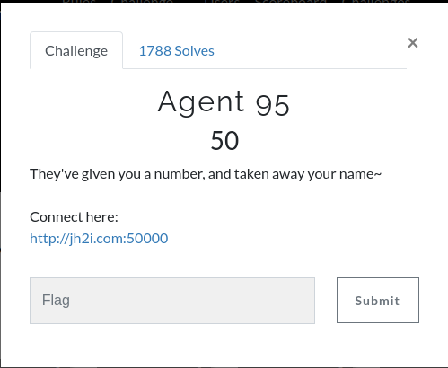
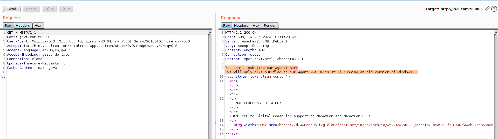

## Agent 95 by sAINT_barber
---

Description:

After viewing the website we only get a note:

`You don't look like our agent!
We will only give our flag to our Agent 95! He is still running an old version of Windows...`

From the challenge title and the description on the web page looks like we need to emulate an old version of windows by modifing our User-Agent header in the request. After searching online for: 

`Windows 95 user agent`

I found this:

`Mozilla/4.0 (compatible; MSIE 5.5; Windows 95; BCD2000)`

All we need to do now is intercept the request in Burp, or just use the developer tools, and modify the User-Agent header

Without chaging the user agent:

